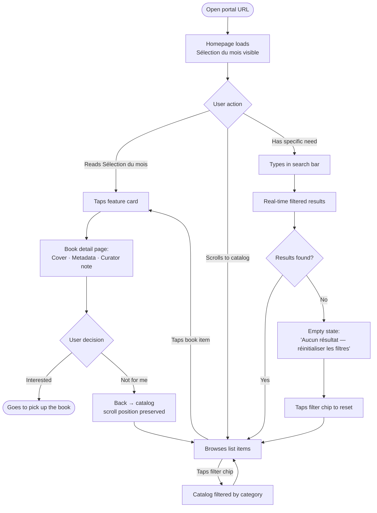
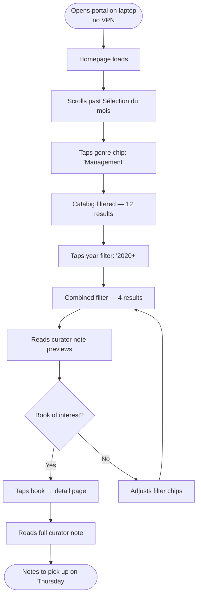
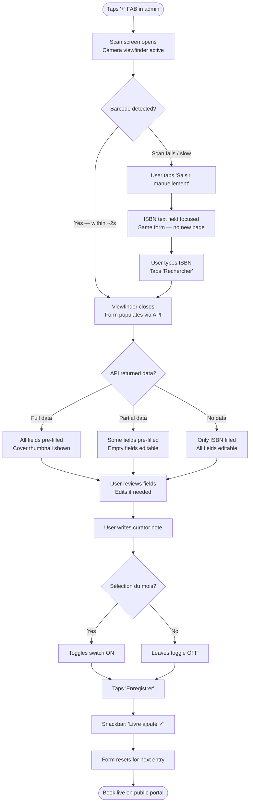
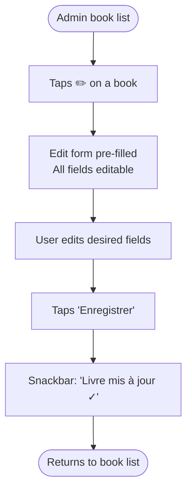

# UX Design Specification — Portail Médiathèque Conviviale

**Author:** Sezratty
**Date:** 2026-04-12

---

<!-- UX design content will be appended sequentially through collaborative workflow steps -->

## Executive Summary

### Project Vision

A publicly accessible, visually engaging catalog for a physical 60-book corporate library at a French ESN. The portal's purpose is not library management — it is a conversation starter. The curator's personal notes transform a bare catalog into a reading guide. Two homepage editorial sections ("Recently Added" and "Sélection du mois") give employees a reason to return and the animator a publishing rhythm.

### Target Users

**Employees (public, unauthenticated):** Knowledge workers and consultants browsing primarily on mobile, including from home. Discovery-oriented — they want to know what's available before making the physical trip. Expect zero friction: no login, instant load, works without VPN.

**Library Animator / Admin (Sezratty):** Solo curator managing the collection from a smartphone. Needs a fast, reliable add-book flow (ISBN scan → auto-fill → save in under 60 seconds). Simplicity over feature density.

### Key Design Challenges

1. **Mobile-first rich content:** Cover images and curator notes must be visually compelling on small screens without sacrificing scanability. Card layout decisions are critical.
2. **Browser-based ISBN scan UX:** Camera barcode scanning in a browser needs clear feedback — visible viewfinder, instant scan confirmation, and a friction-free fallback to manual ISBN entry.
3. **Admin simplicity:** The admin interface must stay minimal — no dashboard complexity, just fast CRUD. Resisting over-engineering is a design constraint.

### Design Opportunities

1. **Curator note as hero:** Typographically elevate the animator's personal note on book detail pages — this is the product differentiator, not the metadata.
2. **Homepage as editorial surface:** "Sélection du mois" deserves visual weight beyond a list item — a feature card with cover, title, and the curator's voice.
3. **Speed as a design value:** Zero-friction browsing (public) and 60-second add flow (admin) should feel intentional through design choices — minimal transitions, immediate feedback, no unnecessary steps.

## Core User Experience

### Defining Experience

The portal has two distinct core experiences with different success definitions:

**For employees:** Visual discovery — landing on the homepage, seeing the "Sélection du mois" feature prominently, then scrolling the catalog. The core loop is browsing, not searching. A successful session ends when a cover + curator note combination triggers the thought "I want to read that."

**For the animator:** Frictionless catalog maintenance — scanning a barcode, reviewing auto-filled metadata, writing a curator note, and saving. The core loop is add → publish. A successful session takes under 60 seconds and requires only a smartphone.

### Platform Strategy

- **Public interface:** Mobile-first web SPA. Touch-optimized layout, readable without pinching or zooming, works without VPN on any modern mobile browser.
- **Admin interface:** Smartphone portrait mode — large touch targets, camera access for barcode scanning, minimal form complexity. No desktop required.
- **Shared constraint:** Evergreen browsers only (Chrome, Firefox, Safari, Edge — last 2 versions). No native app, no PWA.

### Effortless Interactions

- **Public:** Homepage loads immediately with no modal, no login prompt, no cookie wall. The "Sélection du mois" card is the first thing seen. Browsing the catalog requires zero setup.
- **Public:** Book detail accessible in one tap from any catalog entry. Curator note readable without scrolling past metadata.
- **Admin:** ISBN scan → auto-fill → save is a linear 3-step flow with no dead ends. If the scan fails, manual ISBN entry is immediately available in the same view. If the API returns nothing, all fields are editable in place.
- **Admin:** "Sélection du mois" flag is a single toggle on the add/edit form — not a separate workflow.

### Critical Success Moments

1. **The cover + note moment:** A visitor sees a book cover alongside the animator's curator note and feels the pull to pick it up. This is the product's core value — design must frame this pairing clearly.
2. **The 60-second save:** The animator scans a barcode, the form fills in, they add a note and tap save. The book is immediately live. No confirmation dialogs, no review queue.
3. **The homepage return visit:** A colleague who visited last week returns and immediately sees the "Sélection du mois" has changed — a signal the portal is alive and curated.

### Experience Principles

1. **Discovery before search:** The homepage is a browsing surface, not a search box. Visual hierarchy favors covers and curator voice over filters.
2. **Catalog view:** List layout with covers + metadata (title, author, genre) — readable and scannable, not a pure image grid. Covers are prominent but don't crowd out information.
3. **Editorial weight on the homepage:** "Sélection du mois" is a feature card at the top — larger cover, full curator note visible, visual separation from the rest of the catalog.
4. **Admin is a tool, not a product:** The admin interface is minimal by design — fast CRUD with no dashboard, no metrics, no complexity beyond what's needed to manage a 60-book collection.
5. **No friction gates:** Public users encounter zero authentication barriers. Admin access via a discreet link/button on the public site — unobtrusive to visitors, accessible when needed.

## Desired Emotional Response

### Primary Emotional Goals

**For employees (public browsing):**
*Pleasant discovery leading to anticipation.* The portal should feel like browsing a well-curated shelf — not task completion, but the quiet pleasure of finding something worth reading. The emotional arc: **curiosity → pull → anticipation** of picking the book up.

**For the animator (admin):**
*Competence and ease.* The satisfaction of a tool that doesn't fight you. Scan, review, note, save — done. The dominant feeling is quiet efficiency, not achievement.

**Overall product tone:** *"Simple and it just works."* Every design decision should be tested against this. If a feature or element adds visual noise or requires explanation, it doesn't belong.

### Emotional Journey Mapping

| Stage | Employee | Animator |
|-------|----------|----------|
| Arrival | Immediate comfort — no login, no friction, content visible instantly | Login is fast and remembered — no ceremony |
| Browsing/Working | Gentle pull from covers + curator notes; browsing feels natural | Form fills itself; no wrestling with fields |
| Core moment | Cover + curator note creates desire to read | Book saved and live — quiet satisfaction |
| Error/Fallback | No panic — missing cover or API failure handled gracefully, no broken UI | Scan fails → manual entry is right there, no dead end |
| Return visit | Homepage feels alive — "Sélection du mois" has changed, new books visible | Muscle memory — same flow every time |

### Micro-Emotions

- **Confidence, not confusion:** The public user always knows where they are and what to do next — no orphaned pages, no dead links
- **Trust, not skepticism:** A discreet catalog freshness signal (e.g., "X livres · mis à jour le [date]" in the footer or below the catalog header) tells visitors the collection is maintained without announcing it
- **Delight, not surprise:** The curator note is the moment of unexpected warmth — a human voice in what could otherwise be a dry list
- **Accomplishment, not frustration (admin):** Every save is immediate and visible; no confirmation dialogs, no review queues

### Design Implications

- **"Simple and it just works"** → No onboarding, no tooltips, no modals. The interface is self-evident.
- **Curiosity → pull** → Covers and curator notes are visually paired and given space — not squeezed into a dense list
- **Trust signal** → A single low-key line in the footer or below the catalog: *"X livres dans la collection · Mis à jour le [date]"*
- **No dead ends (admin)** → Every error state has an immediate recovery path visible in the same view
- **Alive portal signal** → "Sélection du mois" is dated or labeled (e.g., "Avril 2026") so returning visitors know it's fresh

### Emotional Design Principles

1. **Invisible interface:** The best interaction is the one the user doesn't notice — they just get what they came for
2. **Human voice over metadata:** The animator's note is the emotional core; typography and layout must give it room to breathe
3. **Passive trust:** The portal signals currency and care without demanding attention — freshness date, complete covers, no broken states
4. **No dead ends:** Every failure state — broken cover, failed scan, empty API response — has a graceful path forward visible immediately
5. **Calm efficiency:** Neither the public nor the admin experience should feel rushed or complex. The right pace is quiet and sure.

## UX Pattern Analysis & Inspiration

### Inspiring Products Analysis

**VS Code** — Zero-friction tool design. Opens and works immediately with no onboarding, no wizard, no setup ceremony. Powerful capabilities (search, extensions) are available but not pushed onto the user. Every action has instant, quiet feedback. Error states are clear and actionable.

**Trainline** — Mobile-first card-based information design. Cards carry exactly the right density: enough to decide, not enough to overwhelm. Secondary detail is one tap away, not front-loaded. No dead ends — every error has a visible next step. Touch targets are generous and forgiving.

**Spotify** — Discovery-first visual browsing. Cover art is the primary navigation element — browsing is visual, not textual. Editorial curation (featured playlists, "New releases") has real visual weight: a large feature card at the top, separate from the scrollable grid below. Human curation feels warm and personal — distinct from algorithmic lists.

### Transferable UX Patterns

**Navigation & Structure:**
- Spotify's two-zone homepage (large feature card → scrollable catalog below) → maps directly to "Sélection du mois" card + catalog list
- VS Code's sidebar-free simplicity → admin panel with no dashboard, no nav chrome, just the task

**Interaction Patterns:**
- Trainline's "tap card → detail view" pattern → book card → book detail page
- VS Code's instant, quiet feedback on save → admin save with no modal, no confirmation dialog, just immediate update
- Trainline's inline error recovery → admin scan failure → manual ISBN field appears in place, no navigation away

**Visual Patterns:**
- Spotify's cover-first browsing → list layout with prominent covers left-anchored, metadata right
- Trainline's card density → title + author + genre readable at a glance; curator note reserved for detail view
- Spotify's editorial card → "Sélection du mois" as a full-width feature card with large cover + visible curator note

### Anti-Patterns to Avoid

- **Spotify's algorithm noise** — infinite scroll, "Fans also like", social features. This portal is curated, not algorithmic. No recommendations, no related books, no "popular" signals.
- **VS Code's complexity ceiling** — settings panels, multi-pane layouts. Admin stays single-column, single-task.
- **Trainline's upsell friction** — promotional banners, seat selection overlays. The portal has nothing to sell. No promotional surface.
- **Any product's modal habit** — login prompts, cookie walls, newsletter popups. Zero modals on the public interface.

### Design Inspiration Strategy

**Adopt directly:**
- Spotify's two-zone homepage structure (feature card → catalog)
- Spotify's cover-as-hero visual language
- VS Code's zero-ceremony interaction model for admin
- Trainline's card information density and touch target sizing

**Adapt:**
- Spotify's editorial card → simpler, text-forward version (curator note is the content, not a background image)
- Trainline's list cards → add cover image left-anchor, tune density for a reading context rather than a transactional one

**Avoid:**
- Algorithmic or social features from any of the three
- Any modal, overlay, or promotional surface
- Multi-level navigation or dashboard chrome

## Design System Foundation

### Design System Choice

**Angular Material (MDC)** with a custom warm editorial theme.

### Rationale for Selection

- First-party Angular integration — no adapter layer, no compatibility risks, minimal configuration
- Complete component coverage for all required UI: cards, list items, form fields, buttons, filter chips, snackbars, bottom sheets (for mobile scan flow)
- Accessible by default — touch targets, ARIA attributes, keyboard navigation handled at the component level
- Theming via CSS custom properties — straightforward to apply the custom palette without overriding component internals
- Right fit for a solo developer on a spare-time project — no time spent building primitive components

### Color Palette

| Role | Token | Value |
|------|-------|-------|
| Background | `--color-background` | `#F8F5F0` |
| Surface (cards) | `--color-surface` | `#FFFFFF` |
| Text primary | `--color-on-surface` | `#1A1A1A` |
| Text secondary | `--color-on-surface-variant` | `#6B6561` |
| Accent / Primary | `--color-primary` | `#B85C38` |
| Accent light | `--color-primary-container` | `#F4E4DC` |
| Border / divider | `--color-outline` | `#E8E3DD` |

**Rationale:** Warm parchment background evokes reading and books without being decorative. Deep terracotta accent is warm and human — works alongside diverse cover art without clashing. High contrast on charcoal/parchment for mobile readability.

### Typography

- **Font:** Inter (system stack fallback: `-apple-system, BlinkMacSystemFont, 'Segoe UI'`)
- **Scale:** Angular Material default type scale — no custom display sizes needed at this scope
- **Curator note:** Set in a slightly larger body size with relaxed line-height (`1.6`) to give the human voice visual room

### Implementation Approach

- Apply Angular Material M3 theming via `@use '@angular/material' as mat` with a custom palette derived from the terracotta accent
- Override background and surface tokens in the global theme to use warm parchment instead of Material's default white
- No third-party icon library — use Angular Material Icons (already bundled)

### Customization Strategy

- Minimal overrides: only background, surface, and primary palette tokens need customization; all other Material defaults are appropriate
- Book cover images provide natural color variety — the neutral palette is intentionally restrained to not compete with cover art
- Admin interface uses the same theme — no separate admin stylesheet needed

## Core User Experience

### 2.1 Defining Experience

**For employees:** *"Browse covers and find a book worth picking up."*
The defining moment is a visitor seeing a book cover alongside the curator's note and feeling the pull to go get it. This is not search — it is browsing. Like walking past a well-arranged shelf and stopping because something catches your eye.

**For the animator:** *"Scan a barcode and have the book live on the portal in under 60 seconds."*
The defining moment is the barcode scan triggering an instant auto-fill — watching the form populate itself — then adding a personal note and tapping save. Fast, reliable, satisfying.

### 2.2 User Mental Model

**Employees:** The mental model is a bookshop or a library display — not a search engine, not a database. Users expect to scroll visually, be drawn in by covers, and read short human descriptions before deciding if something is worth their time. They do not expect to fill in search fields to start browsing.

**Animator:** The mental model is a barcode scanner at a checkout — point, shoot, done. Users expect the scan to work on the first try, the form to fill itself, and the save to be immediate. The fallback (manual entry) should feel like a cashier typing a price manually — a known alternative, not a failure.

### 2.3 Success Criteria

**Employee browsing:**
- Homepage is fully visible and interactive within 3 seconds, no friction gates
- "Sélection du mois" card is the first element with visual weight — readable without scrolling on mobile
- A book's cover + curator note is readable together without navigating away (on the detail page, both are above the fold on mobile)
- Filter combinations return results instantly — no loading state for a 60-book catalog

**Admin add flow:**
- Barcode scan triggers auto-fill within 2 seconds of a successful read
- If the scan fails, the manual ISBN field is visible in the same view — no navigation required
- After save, the book appears in the catalog immediately — no reload, no confirmation dialog
- The full flow (scan → review → write note → save) completes in under 60 seconds on a standard smartphone

### 2.4 Novel vs. Established Patterns

Both core experiences use **established patterns** — no novel interaction design required:

- **Browse + detail** (Spotify, Trainline): established list/card → detail navigation pattern
- **Barcode scan in browser**: established via `BarcodeDetector` Web API and ZXing-js; users familiar with QR code scanning in browsers have the right mental model
- **Form auto-fill from external lookup**: established pattern (address autocomplete, ISBN lookup in bookshop tools)

No user education needed. The only friction point to design around is scan fallback — which must feel like a natural continuation, not an error state.

### 2.5 Experience Mechanics

**Public browsing flow:**

1. **Arrival:** Homepage loads immediately — "Sélection du mois" feature card visible, catalog list below
2. **Browsing:** User scrolls the catalog list; each item shows cover (left) + title, author, genre (right); tap opens detail
3. **Detail:** Book detail page shows large cover, full metadata, and curator note prominently; back navigation returns to catalog with scroll position preserved
4. **Search/filter:** Filter bar above catalog; typing or selecting filters narrows results in real time; filters are dismissible chips

**Admin add-book flow:**

1. **Initiation:** Admin taps "Ajouter un livre" — camera viewfinder opens full-screen with a scan overlay
2. **Scan:** Barcode detected → viewfinder closes → form populates with auto-filled data; scanning library provides immediate visual confirmation
3. **Review & edit:** All fields editable; cover thumbnail shown; "Sélection du mois" toggle visible; curator note field focused by default after auto-fill
4. **Fallback:** If scan fails after 5 seconds or user taps "Saisir manuellement", viewfinder closes and ISBN text field is focused — same form, no new page
5. **Save:** Tap "Enregistrer" — immediate success feedback (snackbar: "Livre ajouté"), form resets for next entry; book is live on public portal instantly

## Visual Design Foundation

### Color System

Based on the warm editorial palette established in the Design System Foundation:

| Role | Token | Value | Usage |
|------|-------|-------|-------|
| Background | `--color-background` | `#F8F5F0` | Page background, app shell |
| Surface | `--color-surface` | `#FFFFFF` | Cards, form fields, dialogs |
| Text primary | `--color-on-surface` | `#1A1A1A` | Body text, headings, titles |
| Text secondary | `--color-on-surface-variant` | `#6B6561` | Author, genre, metadata labels |
| Accent / Primary | `--color-primary` | `#B85C38` | Buttons, active states, links |
| Accent container | `--color-primary-container` | `#F4E4DC` | Filter chips, tag backgrounds |
| Outline | `--color-outline` | `#E8E3DD` | Card borders, dividers, input borders |
| Error | `--color-error` | `#BA1A1A` | Scan error, validation feedback |
| Success | `--color-success` | `#386A20` | Save confirmation snackbar |

**Contrast ratios (WCAG AA compliance as a baseline):**
- `#1A1A1A` on `#F8F5F0` → ~16:1 ✓
- `#6B6561` on `#FFFFFF` → ~5.4:1 ✓
- `#B85C38` on `#FFFFFF` → ~4.6:1 ✓ (meets AA for large text and UI components)

### Typography System

**Font family:** Inter, with system stack fallback (`-apple-system, BlinkMacSystemFont, 'Segoe UI', sans-serif`)

| Scale | Size | Weight | Line height | Usage |
|-------|------|--------|-------------|-------|
| Display | 24px | 600 | 1.3 | Portal name / page titles |
| Title large | 20px | 600 | 1.3 | "Sélection du mois" card title, section headers |
| Title medium | 16px | 600 | 1.4 | Book title in list and detail |
| Body large | 16px | 400 | 1.6 | Curator note — relaxed line-height for readability |
| Body medium | 14px | 400 | 1.5 | Author, genre, metadata |
| Label | 12px | 500 | 1.4 | Filter chips, tags, freshness signal |

**Key rule:** Curator note always rendered in Body large with `1.6` line-height — this is the most-read text in the product and must be comfortable on mobile.

### Spacing & Layout Foundation

**Base unit:** 8px. All spacing values are multiples of 8px (4px for fine adjustments).

**Common spacing tokens:**
- `xs`: 4px — icon padding, chip internal spacing
- `sm`: 8px — between label and value, tight internal padding
- `md`: 16px — card internal padding, form field spacing
- `lg`: 24px — between sections on homepage
- `xl`: 32px — page-level vertical rhythm

**Layout grid:**
- **Mobile (< 600px):** Single column, 16px horizontal margins
- **Tablet (600–960px):** Single column, 24px horizontal margins, max-width 720px centered
- **Desktop (> 960px):** Single column, max-width 800px centered — no multi-column layout needed for a 60-book catalog

**Single column rationale:** The catalog is a vertical scroll experience on all breakpoints. A grid of covers would work at desktop but fights the list + metadata pattern chosen for scannability.

**Book list item anatomy:**
```
[ Cover image 72×100px ] [ Title (Title medium)          ]
                          [ Author · Genre (Body medium)  ]
                          [ Curator note preview 2 lines  ]
```
- Cover: fixed 72×100px, object-fit: cover, warm grey placeholder if missing
- Right column: fills remaining width, 12px left padding from cover
- Curator note preview: 2-line clamp on list; full text on detail page

### Accessibility Considerations

- No formal WCAG target required for v1; colour contrast ratios meet AA baseline by design
- Touch targets: minimum 44×44px on all interactive elements (Angular Material default)
- Cover image alt text: book title used as alt attribute — no decorative-only images
- Filter chips keyboard-navigable via Angular Material chip list component
- Admin form fields: all inputs labelled (Angular Material `mat-label`) — no placeholder-only labels
- Missing cover: warm grey placeholder (`#E8E3DD`) with book icon — never a broken image icon

## Design Direction Decision

### Design Directions Explored

A single cohesive direction was generated and validated — the Warm Editorial direction — applied across 5 key screens: Homepage, Book Detail, Admin Book List, Admin ISBN Scan (scanner + form), and Admin Login. HTML mockup available at `_bmad-output/planning-artifacts/ux-design-directions.html`.

### Chosen Direction

**Warm Editorial** — single confirmed direction. Key characteristics:

- Parchment background (`#F8F5F0`) with white card surfaces — warm, book-adjacent feel
- "Sélection du mois" as a prominent feature card at the top of the homepage, with badge, month label, cover, and full curator note visible
- Catalog as a vertical list of book items: cover (left, 56×80px) + title/author/genre/note preview (right)
- Book detail: centered large cover, metadata chips, curator note in a dedicated section with editorial label
- Admin: dark app bar for clear context separation, scan viewfinder full-screen, auto-filled form with editable fields and Sélection du mois toggle
- Portal name: **"Médiathèque conviviale"** — wordmark with accent color on "conviviale"
- Freshness signal: footer line "X livres dans la collection · Mis à jour le [date]"
- Discreet "Admin" text link in the top-right of the public app bar

### Design Rationale

- Warm palette differentiates from generic enterprise tools without requiring custom illustration or photography
- List layout over grid: scannability + curator notes visible in preview — the differentiator is readable without a tap
- Feature card pattern (Spotify-inspired) gives the animator's monthly editorial pick the visual weight it deserves
- Admin dark header creates immediate visual context switch — the user knows they're in a different mode
- Single column layout throughout — no multi-column needed for a 60-book catalog; simplicity wins

### Implementation Approach

- Angular Material M3 theming with custom terracotta palette applied globally
- Homepage: two distinct zones — `mat-card` for Sélection du mois, custom list component for catalog items
- Book detail: standalone routed component, cover centered with `mat-card` for curator note section
- Admin book list: `mat-list` with action buttons; FAB (`mat-fab`) for add action
- Admin form: `mat-form-field` for all inputs; `mat-slide-toggle` for Sélection du mois flag; `mat-snack-bar` for save confirmation
- Scan screen: full-screen overlay component with ZXing-js/BarcodeDetector integration

## User Journey Flows

### Journey 1 — Employee: Homepage Discovery → Book Detail



**Key design decisions:**
- Homepage loads content immediately — no skeleton loader for a 60-book catalog
- Scroll position preserved on back navigation — no disorienting jump to top
- Empty state provides a clear action (reset filters), not a dead end
- Sélection du mois taps directly to detail — same route as catalog items

---

### Journey 2 — Employee: Filter-Based Browse (Remote, from home)



**Key design decisions:**
- Filters are additive chips — tapping multiple chips narrows results progressively
- No "Apply" button — filters apply instantly on tap
- Chip state is visually clear (active terracotta vs. inactive grey)

---

### Journey 3 — Animator: ISBN Scan → Book Live on Portal



**Key design decisions:**
- Single screen throughout — scan fail never navigates away
- API partial/no data gracefully shows what's available; all fields remain editable
- Curator note field is the only field with no API source — cursor focus goes there after auto-fill
- Save is fire-and-forget — no confirmation dialog, immediate snackbar feedback

---

### Journey 4 — Animator: Edit an Existing Book



**Key design decisions:**
- Edit reuses the same form component as Add — no separate design
- No confirmation on save — consistent with the Add flow

---

### Journey Patterns

**Navigation patterns:**
- **Back preserves state:** All back navigations return user to previous scroll position
- **Single route for detail:** Both feature card and catalog items route to the same book detail component (`/livres/:id`)
- **Admin = separate route tree:** `/admin/*` routes are lazy-loaded, never included in the public bundle

**Decision patterns:**
- **Filters are stateless chips:** No apply button — tap to activate, tap to deactivate, results update instantly
- **Scan fallback is inline:** Failure never triggers a route change — manual ISBN field appears within the same view

**Feedback patterns:**
- **Snackbar for all saves:** `mat-snack-bar` bottom confirmation for add and edit — auto-dismisses after 3 seconds
- **Empty states always actionable:** Every empty or error state provides a visible next step

### Flow Optimization Principles

1. **Minimum taps to value:** Homepage → detail is 1 tap; homepage → filtered result → detail is 2 taps
2. **No dead ends:** Every error state has an immediate recovery action visible without scrolling
3. **State preservation on back:** Catalog scroll position persists across detail navigation
4. **Admin flow is linear:** Scan → fill → note → save. No branching on the happy path.
